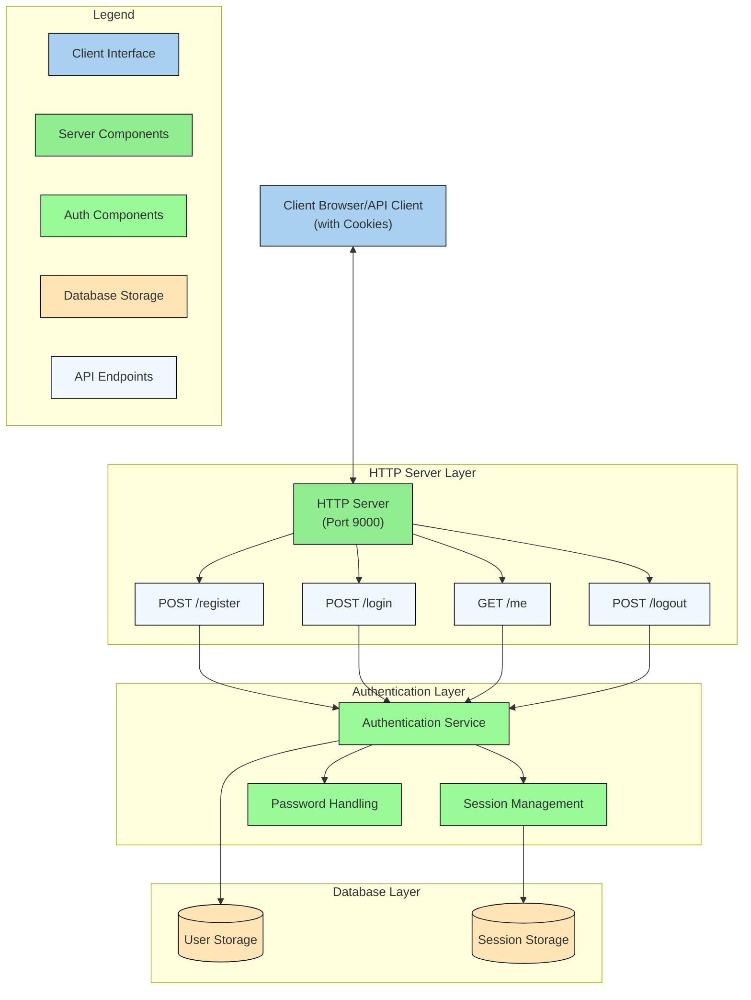

# auth-be-wildin

## Architecture Diagram



## Run the server

```go
go run main.go
```

## Test the server

```curl
curl -X POST http://localhost:9000/register \
 -H "Content-Type: application/json" \
 -d '{"username": "username", "password": "password"}'

curl -X POST http://localhost:9000/login \
    -H "Content-Type: application/json" \
    -d '{"username": "username", "password": "password"}' \
    -c cookies.txt

curl -X GET http://localhost:9000/me \
    -b cookies.txt

curl -X POST http://localhost:9000/logout \
    -b cookies.txt
```
